# 💬 Chichat – Real-Time Chat Application

Chichat is a modern **Flutter + Firebase** real-time messaging application with **Google Sign-In**, **push notifications**, and an **AI-powered chatbot (Google Gemini)** to enhance the user experience.

---

## ✨ Features

- Display only known users or contacts
- Real-time messaging using Firebase Firestore
- Google Sign-In (no mobile number required)
- Add users via email ID
- User profiles (photo, about, last seen, created time)
- Message read status (seen/unseen)
- Edit & delete messages
- Push notifications using Firebase Cloud Messaging (FCM)
- AI Chatbot integration using **Google Gemini**
- Clean & sleek UI with modern Material widgets
- **And much more…**

---

## 📱 Screenshots

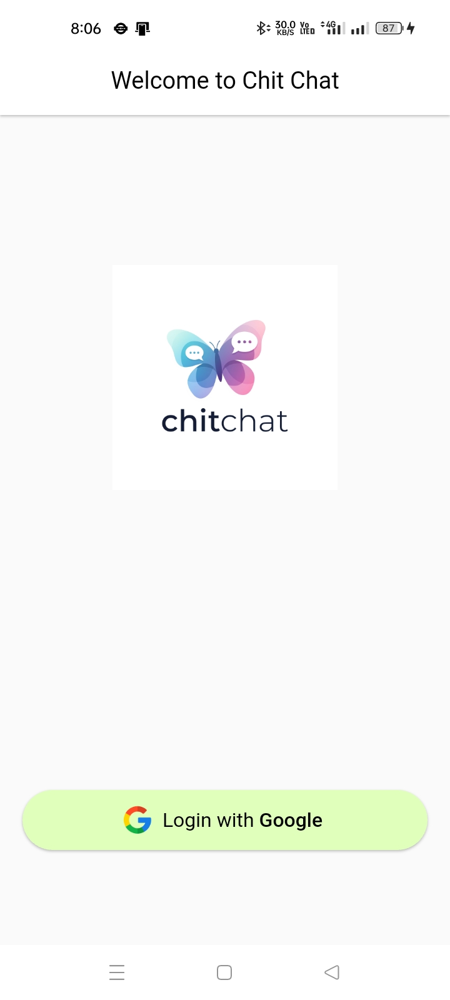

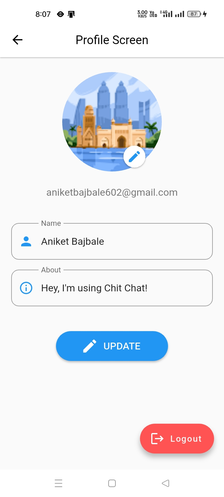
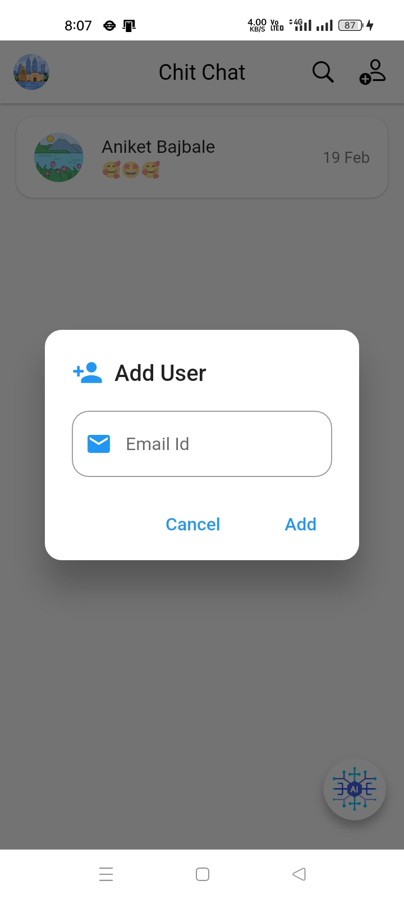
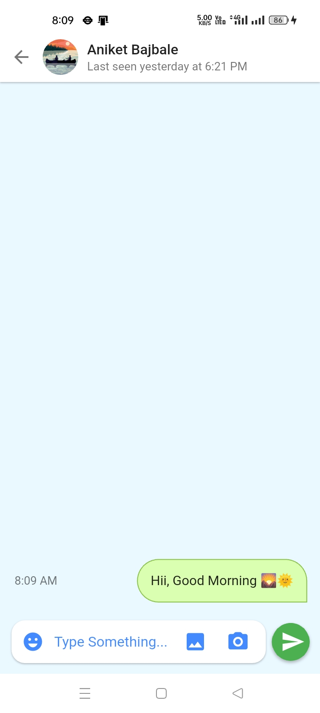
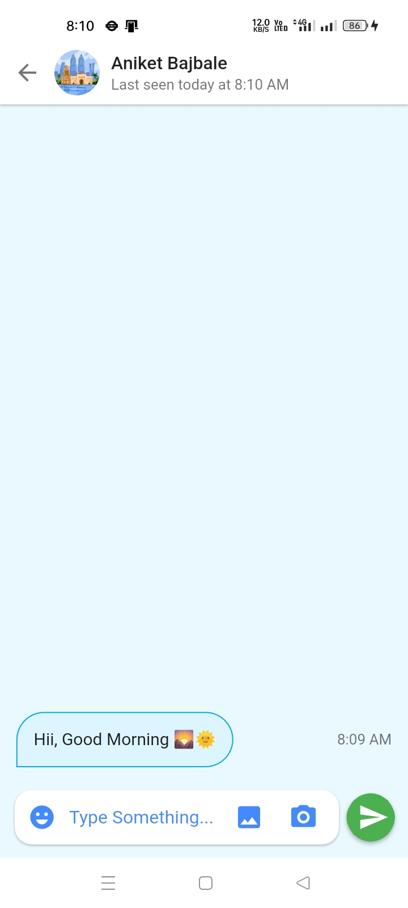
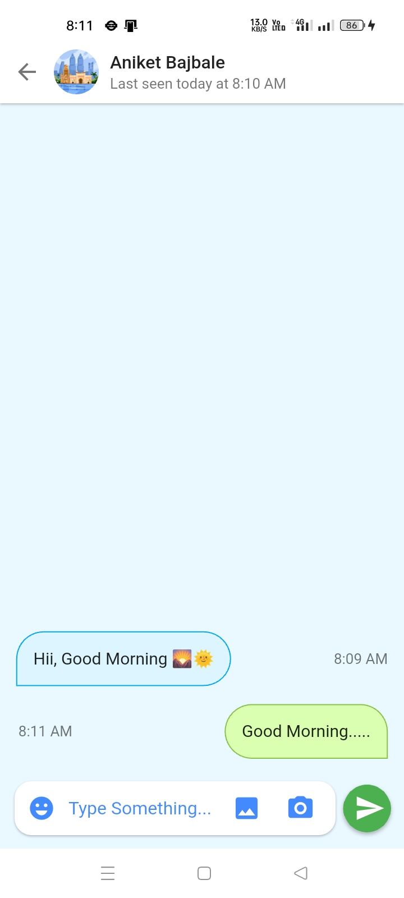
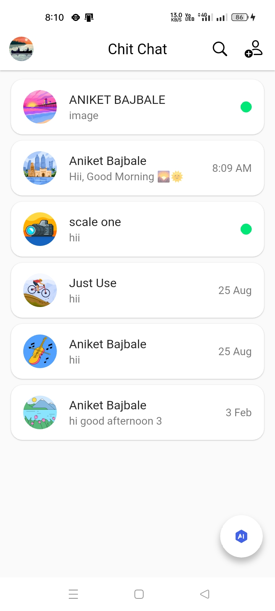
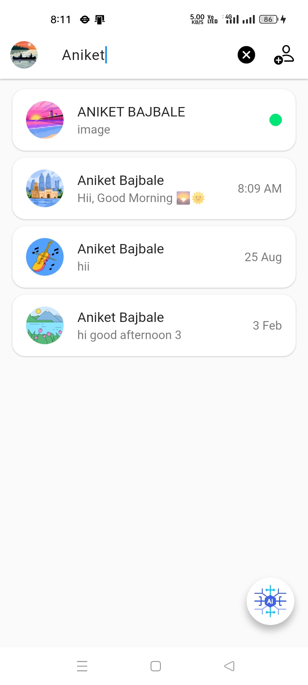
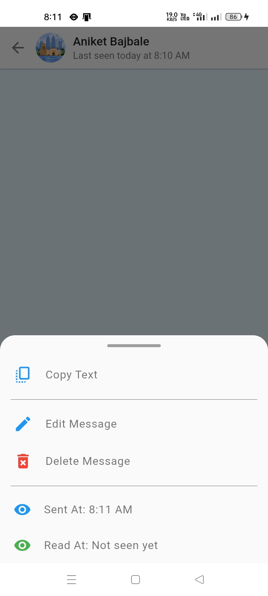
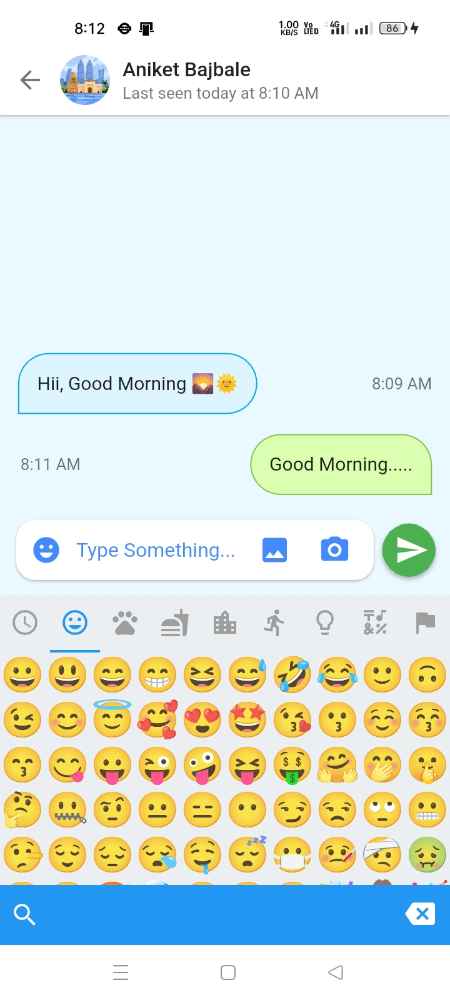
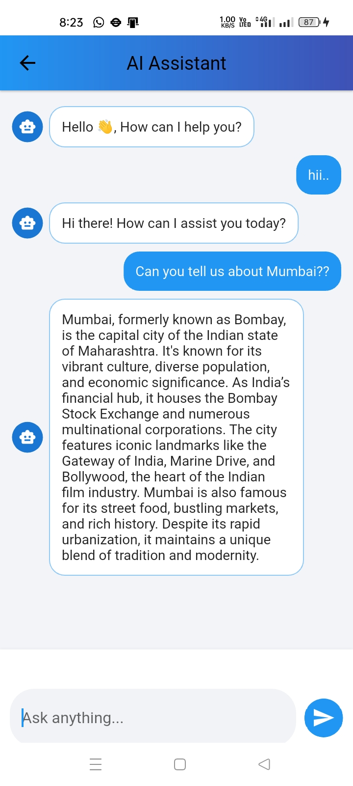


---

## 🧩 Tech Stack

- Flutter
- Dart
- Firebase Authentication
- Cloud Firestore
- Firebase Cloud Messaging (FCM)
- Google Sign-In
- Google Gemini AI

---

## ⬇️ Download APK

👉 Download the latest APK from GitHub Releases:  
https://github.com/aniket9787/ChitChat/releases

---

## ▶️ How to Run the Project

```bash
flutter pub get
flutter run
